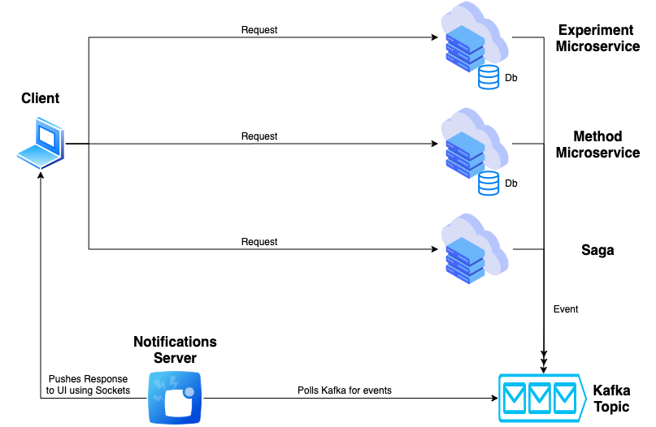

# Introduction
This is an implementation of a simple distributed system using .Net Core.

The business is quite simple. There are 2 entities. The first is **Experiment** and the second is **Method**. An experiment can have 0 or many methods, and a method can belong to 0 or many experiments.

# Architecture

# Technologies
* Domain-Driven Design
* Event Sourcing
* CQRS
* Saga Pattern (using [Chronicle](https://github.com/snatch-dev/Chronicle))
* [Kafka](https://kafka.apache.org/)

# Projects repositories
* [TestPlanning.Experiments Microservice](https://github.com/Marc19/testplanning-poc-experiments)
* [TestPlanning.Methods Microservice](https://github.com/Marc19/testplanning-poc-methods)
* [TestPlanning.Saga Service](https://github.com/Marc19/testplanning-poc-saga)
* [TestPlanning.Notification Server](https://github.com/Marc19/testplanning-poc-notifications)
* [TestPlanning.Frontend](https://github.com/Marc19/testplanning-poc-ui)

# Types of messages
A message being published to a Kafka topic can be one of two types: **Command** or **Event**.

# The journey of a request: The Big Picture

## Request to one microservice
Let's assume a user wants to create a new experiment. This type of request only needs to contact one microservice, which is the **Experiment microservice** in this case.

### **What happens when a user sends a request?**
When the intended microservice receives the request, it creates a new command, publishes it to a Kafka topic and responds back to the client right away stating that the request is now being processed.

**_Example:_** The **Experiment microservice** will receive the request, creates a command with the name **CreateExperiment** and publishes it to the **Experiments** Kafka topic.

### **Who listens to commands in order to process it?**
Each microservice has a Kafka consumer running in the background, listening to any messages it might be interested in. 

**_Example:_** The **Experiment microservice** will retrieve a command named **CreateExperiment**. And it will pass it to its corresponding handler, which in turn, is responsible for executing the command.

### **What happens after a handler handles a command?**
When the handler finishes executing a command. It publishes an event with either success or failure to a Kafka topic.

**_Example:_** After executing the handling logic, our microservice will publish either **ExperimentCreated** event or **ExperimentCreationFailed** event to the **Experiments** Kafka topic.

_At this point, the microservice has completed its job._

### **So how will the client receive the response?**
Now the client needs to be notified that his/her request has completed. That's the purpose of the notification server. The notification server's job is to listen for events and push a response accordingly to a specific user using sockets.

**_Example:_** Our notification server will listen for either **ExperimentCreated** event or **ExperimentCreationFailed** event, and will push the result to the client using SignalR.
